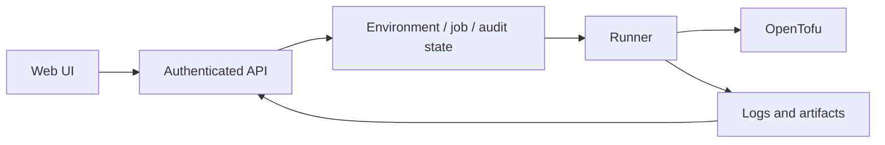

# Infrastructure orchestration: a code tour

The core flow is Environment → plan → approval → apply. API and OpenTofu execution
live in separate processes so requests, jobs and execution evidence can be inspected independently.

| Concern | Entry point |
| --- | --- |
| Lifecycle, revisions and approvals | `internal/domain/environment_lifecycle.go`, `internal/api/environments.go` |
| Authentication and admin actions | `internal/api/auth.go`, `internal/api/middleware.go` |
| Work execution and logs | `internal/executor/`, `cmd/runner/` |
| Provider configuration | `internal/provider/`, `internal/storage/mysql/provider_secret.go` |
| Templates and validation | `internal/renderer/`, `internal/runtimecheck/`, `templates/opentofu/` |
| User workflow | `web/src/pages/`, `web/src/components/` |



## Checks without cloud credentials

From the repository root, with the Go version specified in `go.mod`:

```sh
go build -mod=readonly ./...
go test -mod=readonly ./internal/... ./cmd/...
```

Both commands passed during the 2026-09-11 portfolio review. Tests use local/mocked
contracts; this is not evidence of production OpenStack compatibility or an SLA.
Frontend build instructions: `cd web && npm ci && npm run build`.

See [README](../README.md) and [architecture](architecture.md) for the fuller design.
Existing deployment overlays and self-hosted workflows are environment-specific;
they are not a portable Quick start. Reviewing or testing this code does not require
running a deployment workflow. Supply real configuration outside version control.
